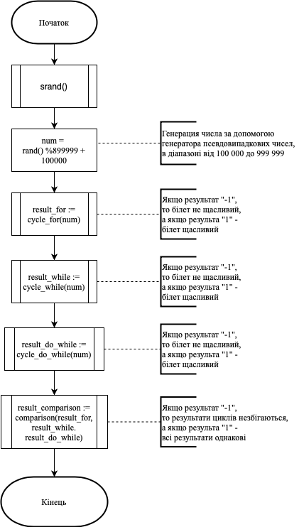
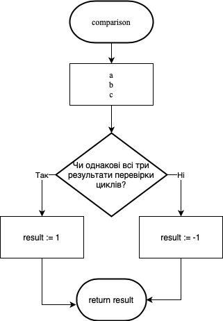
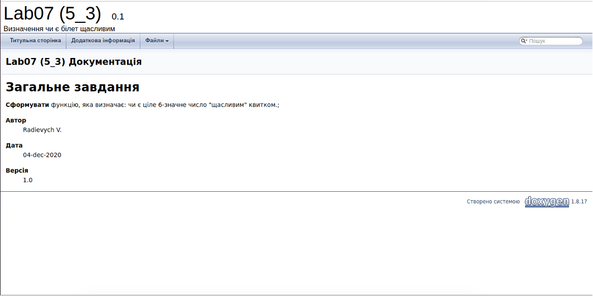
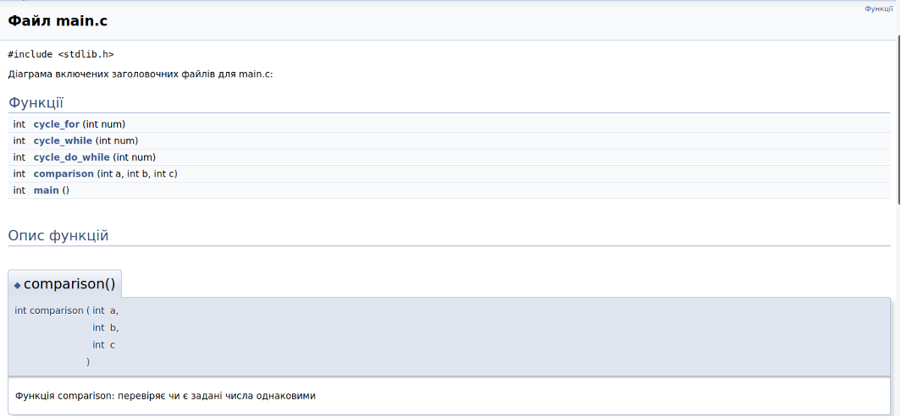
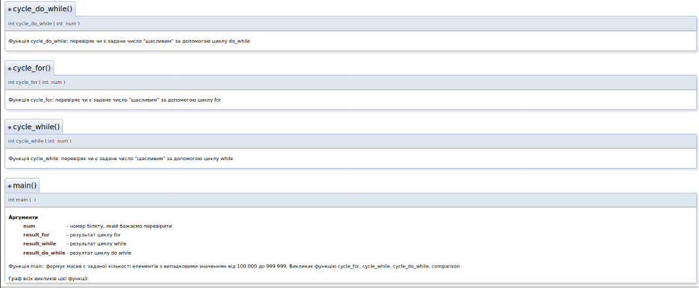
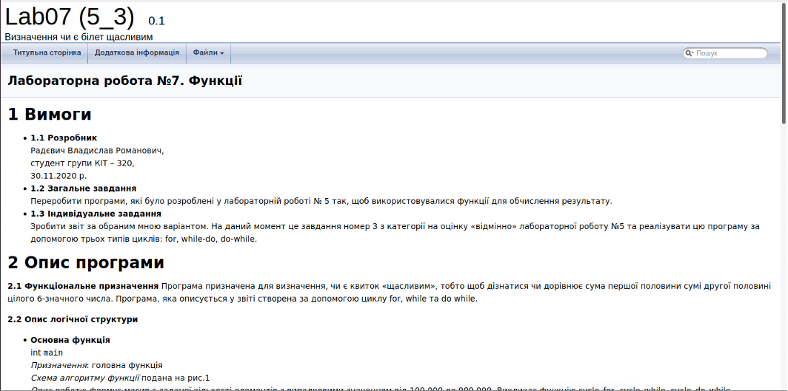
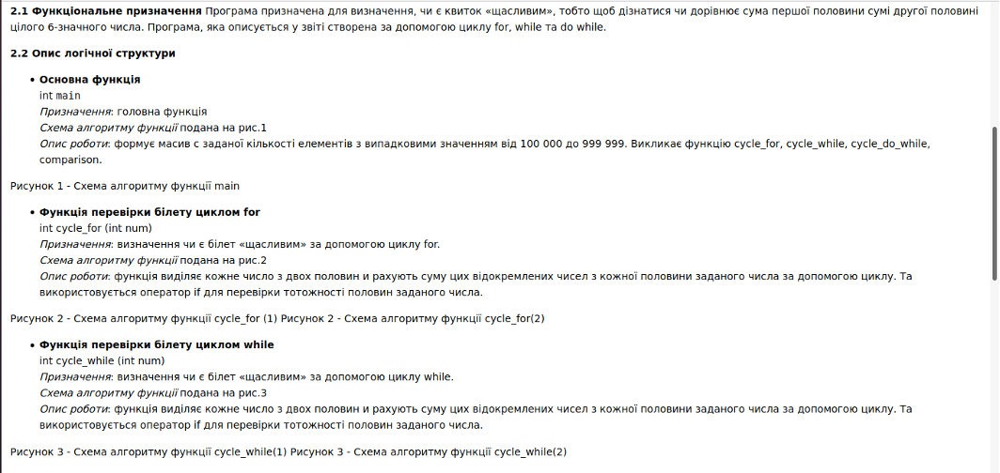
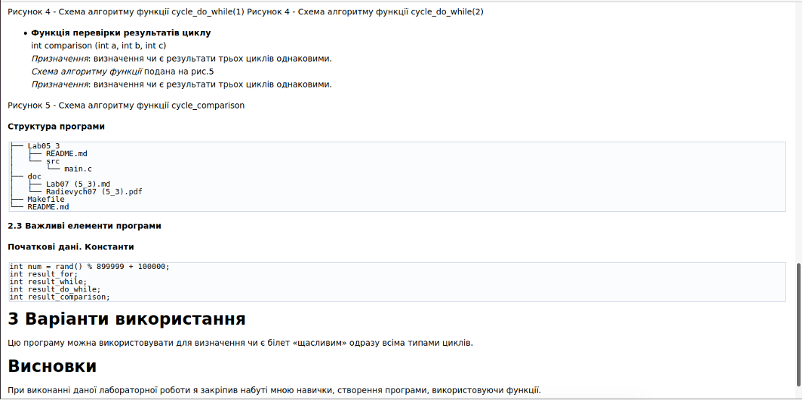

# Лабораторна робота №7. Функції
## 1 Вимоги
* **1.1 Розробник**
	\n Радєвич Владислав Романович,
	\n студент групи КІТ – 320,
	\n 30.11.2020 р.

* **1.2 Загальне завдання** 
\n Переробити програми, які було розроблені у лабораторній роботі № 5 так, щоб використовувалися функції для обчислення результату.

* **1.3 Індивідуальне завдання** 
\n Зробити звіт за обраним мною варіантом. На даний момент це завдання номер 3 з категорії на оцінку «відмінно» лабораторної роботу №5 та реалізувати цю програму за допомогою трьох типів циклів: for, while-do, do-while. 

## 2 Опис програми
**2.1 Функціональне призначення** 
	Програма призначена для визначення, чи є квиток «щасливим», тобто щоб дізнатися чи дорівнює сума першої половини сумі другої половині цілого 6-значного числа. Програма, яка описується у звіті створена за допомогою циклу for, while та do while.

**2.2 Опис логічної структури**

*   **Основна функція** 
   \n int `main`
   	\n *Призначення*: головна функція
   	\n *Схема алгоритму функції* подана на рис.1
   	\n *Опис роботи*: формує масив с заданої кількості елементів з випадковими значенням від 100 000 до 999 999. Викликає функцію cycle_for, cycle_while, cycle_do_while, comparison.



*   **Функція перевірки білету циклом for**
    \n int cycle_for (int num)
    	\n *Призначення*: визначення чи є білет «щасливим» за допомогою циклу for.
    	\n *Схема алгоритму функції* подана на рис.2
    	\n *Опис роботи*: функція виділяє кожне число з двох половин и рахують суму цих відокремлених чисел з кожної половини заданого числа за допомогою циклу. Та використовується оператор if для перевірки тотожності половин заданого числа. 

.png)
.png)
     
*     **Функція перевірки білету циклом while**
     \n int cycle_while (int num)
     	\n *Призначення*: визначення чи є білет «щасливим» за допомогою циклу while.
    	\n *Схема алгоритму функції* подана на рис.3
    	\n *Опис роботи*: функція виділяє кожне число з двох половин и рахують суму цих відокремлених чисел з кожної половини заданого числа за допомогою циклу. Та використовується оператор if для перевірки тотожності половин заданого числа.
    	
.png)
.png)
    	
*      **Функція перевірки білету циклом do while**
     \n int cycle_do_while (int num)
     	\n *Призначення*: визначення чи є білет «щасливим» за допомогою циклу while.
    	\n *Схема алгоритму функції* подана на рис.4
    	\n *Опис роботи*: функція виділяє кожне число з двох половин и рахують суму цих відокремлених чисел з кожної половини заданого числа за допомогою циклу. Та використовується оператор if для перевірки тотожності половин заданого числа.
    	
.png)
.png) 
    	 
*       **Функція перевірки результатів циклу**
       \n int comparison (int a, int b, int c)
	 \n *Призначення*: визначення чи є результати трьох циклів однаковими.
    	 \n *Схема алгоритму функції* подана на рис.5
    	 \n *Призначення*: визначення чи є результати трьох циклів однаковими.



**Структура програми**
```
   ├── Lab05_3
   │   ├── README.md
   │   └── src
   │       └── main.c
   ├── doc
   │   ├── Lab07 (5_3).md
   │   └── Radievych07 (5_3).pdf
   ├── Makefile
   └── README.md
```
**2.3 Важливі елементи програми**

**Початкові дані. Константи**

   ```
	int num = rand() % 899999 + 100000;
	int result_for;
	int result_while;
	int result_do_while;
	int result_comparison;
   ```
## 3 Варіанти використання
	Цю програму можна використовувати для визначення чи є білет «щасливим» одразу всіма типами циклів.
	Результат роботи з doxygen продемонстровано на рисунку 6,
рисунку 7 та рисунку 8.







	Результат роботи з doxygen можна подивитися на рисунку 9,
рисунку 10 та рисунок 11.







## Висновки
	При виконанні даної лабораторної роботи я закріпив набуті мною навички, створення програми, використовуючи функції.
