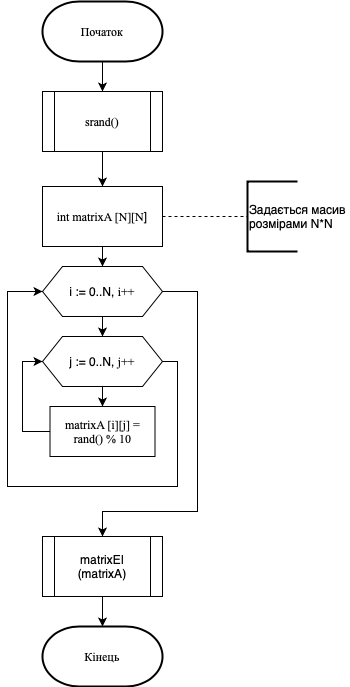
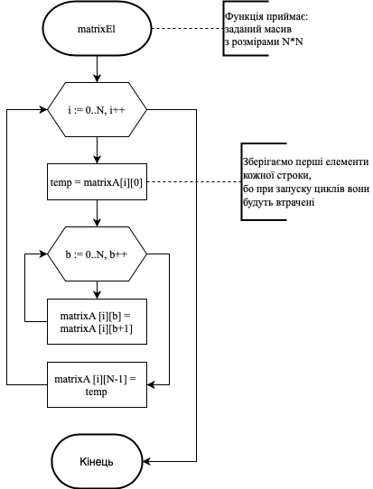

# Лабораторна робота №7. Функції
## 1 Вимоги
* **1.1 Розробник**
	\n Радєвич Владислав Романович,
	\n студент групи КІТ – 320,
	\n 30.11.2020 р.

* **1.2 Загальне завдання**
\n Переробити програми, які було розроблені у лабораторній роботі № 6 так, щоб використовувалися функції для обчислення результату

* **1.3 Індивідуальне завдання** 
\n Зробити звіт за обраним мною варіантом. На даний момент це завдання номер 5 з категорії на оцінку «відмінно» лабораторної роботу №6. 

## 2 Опис програми
**2.1 Функціональне призначення** 
	Програма призначена для визначення матриці з заданими розмірами, елементи першого стовбця якої було зміщено справа наліво залежно від розміру матриці разів, завдяки двомірному масиву та циклу for.

**2.2 Опис логічної структури**

*   **Основна функція** 
   \n int `main`
   	\n *Призначення*: головна функція
   	\n *Схема алгоритму функції* подана на рис.1
   	\n *Опис роботи*: Програма призначена для визначення матриці з заданими розмірами, елементи першого стовбця якої було зміщено справа наліво залежно від розміру матриці разів, завдяки двомірному масиву та циклу for.



*   **Функція зрушення елементів матриці**
    \n void matrixEl(int matrixA[N][N])
    	\n *Призначення*: виконує цинлічне зрушення елементів рядка масиву в напрямку справа наліво.
    	\n *Схема алгоритму функції* подана на рис.2
    	\n *Опис роботи*: виконує цинлічне зрушення елементів рядка масиву в напрямку справа наліво 


     

**Структура програми**
```
   ├── Lab06_5
   │   ├── README.md
   │   └── src
   │       └── main.c
   ├── doc
   │   ├── Lab07 (6_5).md
   │   └── Radievych07 (6_5).pdf
   ├── Makefile
   └── README.md
```
**2.3 Важливі елементи програми**

**Початкові дані. Константи**

   ```
	#define N 3 // розмір матриці в N*N
	int matrixA [N][N];
   ```
## 3 Варіанти використання
	Цю програму можна використовувати за для знаходження матриці певного розміру, якщо поступово перемістити в напрямку справо наліво кожен стовбець матриці. 

## Висновки
	При виконанні даної лабораторної роботи я закріпив набуті мною навички, створення програми, використовуючи функції.
