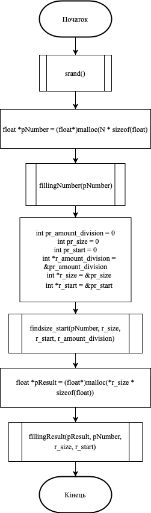
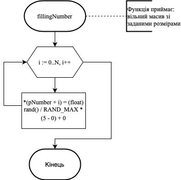
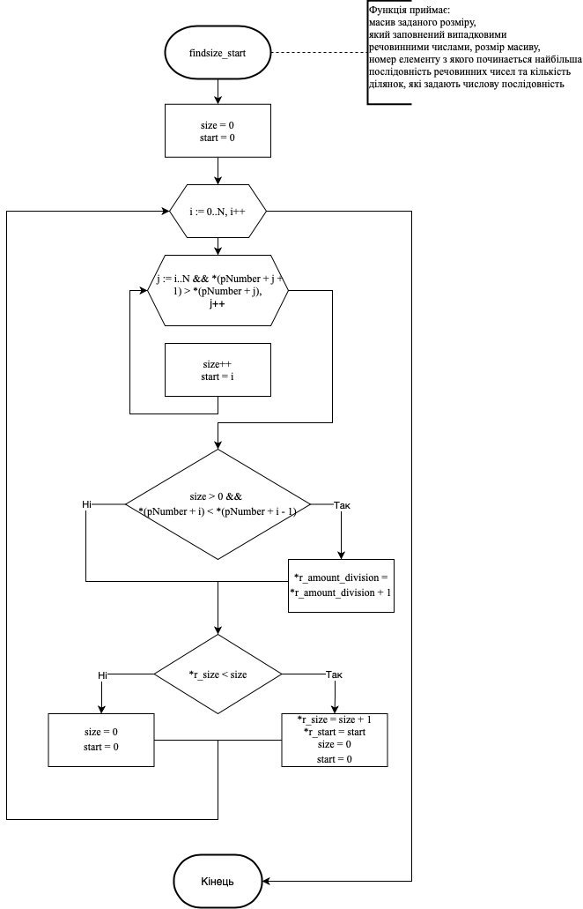
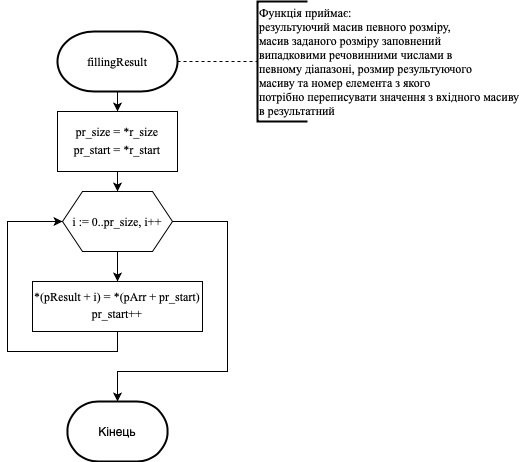
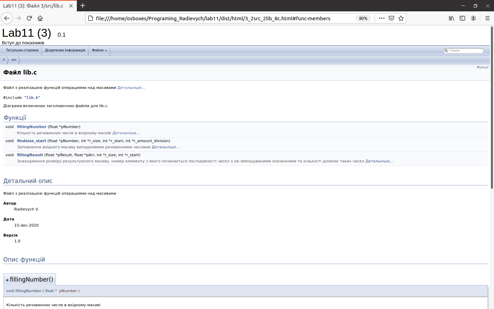
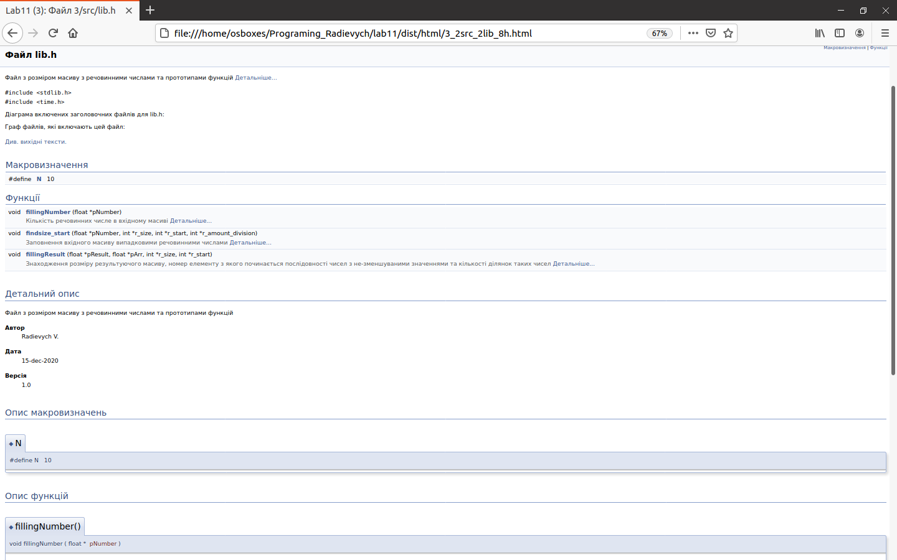
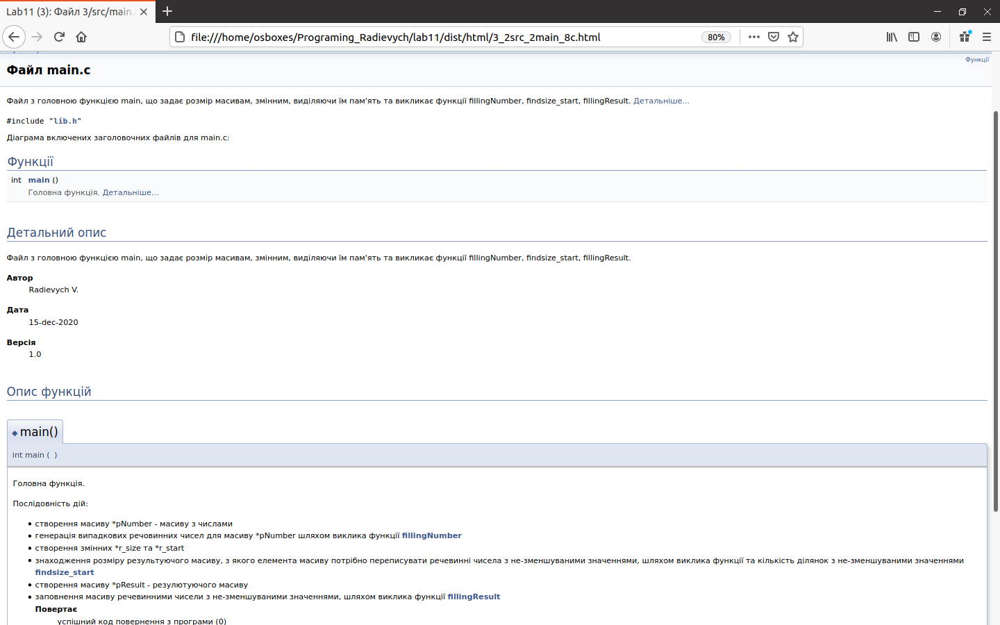

# Лабораторна робота № 11. Вступ до показчиків
## 1 Вимоги
* **1.1 Розробник**
	\n Радєвич Владислав Романович,
	\n студент групи КІТ – 320,
	\n 15.12.2020 р.

* **1.2 Загальне завдання** 
\n Розробити програми, умови яких надано у лабораторному практикуму.  Мною було взято умови для розробки з розділу на оцінку «відмінно».

* **1.3 Індивідуальне завдання** 
\n Зробити звіт за обраним мною варіантом. На даний момент це завдання номер 3. 

## 2 Опис програми
**2.1 Функціональне призначення** 
	Програма призначена для визначення кількість ділянок , які утворюють безперервні послідовності чисел з не-зменшуваними значеннями та знаходження найбільшої ділянки з такими числами, використовуючи показчики. При цьому значення найбільшої ділянки будуть записані в окремий масив.

**2.2 Опис логічної структури**

*   **Основна функція** 
   \n int `main`
   	\n *Призначення*: головна функція
   	\n *Схема алгоритму функції* подана на рис.1
   	\n *Опис роботи*: задає розмір масивам, змінним, виділяючи їм пам'ять. Викликає функції fillingNumber, findsize_start, fillingResult.



*   **Функція заповнення масиву**
    \n void fillingNumber(float *pNumber); 
    	\n *Призначення*: заповнення масиву випадковими речовинними числами.
    	\n *Схема алгоритму функції* подана на рис.2
    	\n *Опис роботи*: кожному елементу масиву, які перебираються за допомогою циклу, присвоюється випадкове значення завдяки функції rand(). 


     
*    **Функція визначення розміру та кількості значень результуючого масиву та кількості з не-зменшуваними речовинними числами**
     \n void findsize_start(float *pNumber, int *r_size, int *r_start, int *r_amount_division)
     	\n *Призначення*: знаходження розміру результуючого масиву, номер елементу з якого починається послідовності чисел з не-зменшуваними значеннями та кількість ділянок з не-зменшуваними речовинними числами.
    	\n *Схема алгоритму функції* подана на рис.3
    	\n *Опис роботи*: функція знаходить кількість ділянок з не-зменшуваними речовинними числами, розмір максимальної ділянки та елемент масиву з якого починається максимальна ділянка з не-зменшуваними значеннями.
    	

    	
*    **Функція заповнення результатного масиву**
     \n void fillingResult(float *pResult, float *pArr, int *r_size, int *r_start)
     	\n *Призначення*: заповнення результуючого масиву числами з не-зменшуваними значеннями,  послідовність, яких найбільша за розміром в масиві.
    	\n *Схема алгоритму функції* подана на рис.4
    	\n *Опис роботи*: кожному елементу масиву присвоюється значення вхідного масиву, починаючи зі знайденого початку та упродовж знайденої кількості таких чисел.
    	

    	 
**Структура програми**
```
   ├── Lab05_3
   │   ├── README.md
   │   └── src
   │       └── main.c
   ├── doc
   │   ├── Lab07 (5_3).md
   │   └── Radievych07 (5_3).pdf
   ├── Makefile
   └── README.md
```

## 3 Варіанти використання
Цю програму можна використовувати за для знаходження максимальної кількості послідовних не-зменшуваних чисел в заданому масиві та знаходження кількості таких послідовностей. 
	\nРезультат роботи з doxygen продемонстровано на рисунку 5,
рисунку 6 та рисунку 7.







##Висновки
    При виконанні даної лабораторної роботи я закріпив набуті мною навички, створення програми, використовуючи показчики.
